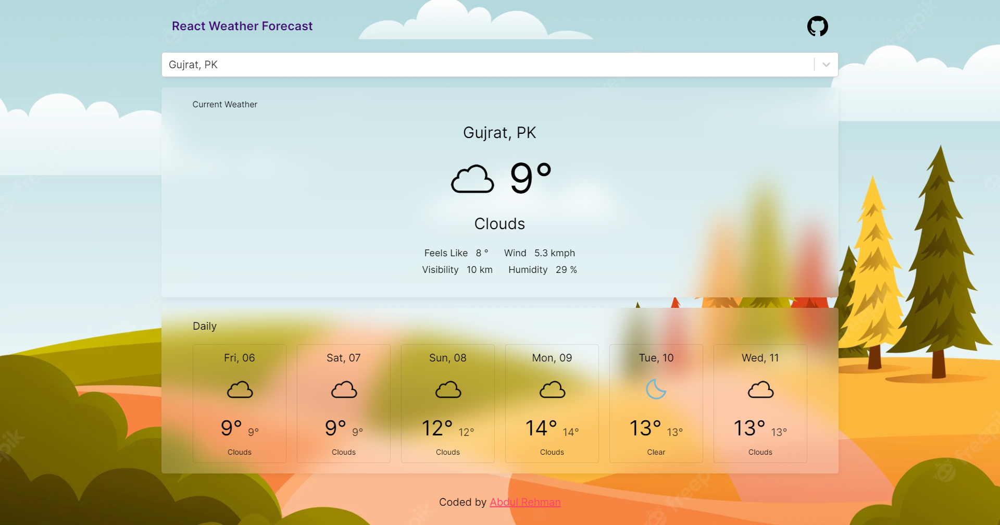

# React Weather Forecast App

Languges & Tools used:
- Html & CSS, SCSS, JavaScript and ReactJS 

Api's used:
* [Geo Cities](https://rapidapi.com/wirefreethought/api/geodb-cities/)
* [Open Weather](https://rapidapi.com/wirefreethought/api/geodb-cities/)

 

## Preview Image
 

